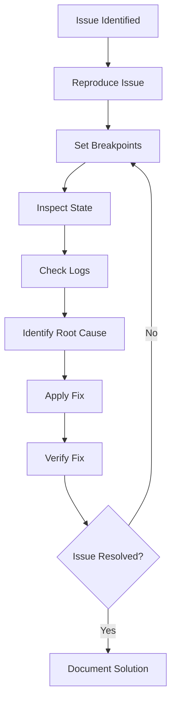

# LangGraph Studio Debugging Guide

This guide provides detailed debugging strategies and solutions for common
issues when using LangGraph Studio with the Supervisor Agent system.

## Table of Contents

1. [Debugging Workflow](#debugging-workflow)
2. [Common Issues](#common-issues)
3. [Error Patterns](#error-patterns)
4. [Performance Debugging](#performance-debugging)
5. [State Debugging](#state-debugging)
6. [Tool Debugging](#tool-debugging)
7. [Advanced Debugging](#advanced-debugging)

## Debugging Workflow

### 1. Systematic Debugging Approach



### 2. Debug Information Collection

Before debugging, collect:

- **Objective**: What was the user trying to accomplish?
- **Configuration**: Which environment and settings were used?
- **Error Messages**: Exact error text and stack traces
- **State Snapshot**: State at the time of failure
- **Execution Log**: Sequence of events leading to the issue

## Common Issues

### Issue 1: Workflow Hangs or Never Completes

#### Symptoms

- Execution appears stuck on a node
- No progress after extended time
- High CPU usage but no advancement

#### Debugging Steps

1. **Set breakpoint on hanging node**:

   ```python
   debugger.add_breakpoint("supervisor")  # or whichever node is hanging
   ```

2. **Check routing logic**:

   ```python
   # In the router function, add logging
   def _supervisor_router(self, state):
       print(f"Router called with iteration: {state['iteration_count']}")
       print(f"TODO list length: {len(state['todo_list'])}")
       # ... rest of router logic
   ```

3. **Inspect state for infinite loops**:

   - Check if `iteration_count` is incrementing
   - Verify task statuses are changing
   - Look for circular dependencies in tasks

4. **Common causes and fixes**:

   ```python
   # Cause: Router always returns same path
   # Fix: Add proper completion detection
   if self.supervisor.is_objective_complete():
       return "finalize"

   # Cause: Tasks never marked as completed
   # Fix: Ensure task status updates
   task["status"] = TaskStatus.COMPLETED.value

   # Cause: Missing termination conditions
   # Fix: Add max iteration check
   if state["iteration_count"] >= self.config.max_iterations:
       return "finalize"
   ```

### Issue 2: Tasks Fail Repeatedly

#### Symptoms

- Tasks marked as "failed" status
- Error messages in artifacts
- Subagent creation failures

#### Debugging Steps

1. **Enable detailed logging**:

   ```python
   # In development environment
   config.debug_mode = True
   config.tool_timeout = 120  # Increase timeout
   ```

2. **Check task requirements**:

   ```python
   # Inspect failed task details
   failed_tasks = [t for t in state["todo_list"] if t["status"] == "failed"]
   for task in failed_tasks:
       print(f"Failed task: {task['description']}")
       print(f"Required tools: {task['required_tools']}")
       print(f"Dependencies: {task['dependencies']}")
   ```

3. **Verify tool availability**:

   ```python
   # Check if required tools are registered
   available_tools = self.tool_registry.get_available_tools()
   for tool in task["required_tools"]:
       if tool not in available_tools:
           print(f"Missing tool: {tool}")
   ```

4. **Check API keys and external services**:
   ```python
   # Verify external API connectivity
   if not config.tavily_api_key:
       print("Tavily API key missing - search_internet will fail")
   if not config.firecrawl_api_key:
       print("Firecrawl API key missing - web_scrape will fail")
   ```

### Issue 3: State Inspector Shows Empty or Incorrect Data

#### Symptoms

- State fields appear empty in studio
- State structure doesn't match expected schema
- Missing or corrupted state data

#### Debugging Steps

1. **Verify state schema**:

   ```python
   # Check if state matches TypedDict definition
   from src.models.data_models import AgentState

   # Validate state structure
   def validate_state(state):
       required_fields = AgentState.__annotations__.keys()
       for field in required_fields:
           if field not in state:
               print(f"Missing state field: {field}")
   ```

2. **Check state updates**:

   ```python
   # Add logging to state update points
   def _supervisor_node(self, state):
       print(f"State before supervisor: {list(state.keys())}")
       # ... node logic
       print(f"State after supervisor: {list(state.keys())}")
       return state
   ```

3. **Inspect state serialization**:
   ```python
   # Check if state can be JSON serialized
   import json
   try:
       json.dumps(state)
   except TypeError as e:
       print(f"State serialization error: {e}")
   ```

### Issue 4: Tool Execution Failures

#### Symptoms

- Tool calls return errors
- Timeout exceptions
- External API failures

#### Debugging Steps

1. **Test tools individually**:

   ```python
   # Test each tool in isolation
   from src.tools.assignable_tools import AssignableTools

   tools = AssignableTools(config, vfs)

   # Test code execution
   result = tools.execute_code("print('Hello, World!')")
   print(f"Code execution result: {result}")

   # Test internet search
   result = tools.search_internet("AI trends 2024")
   print(f"Search result: {result}")
   ```

2. **Check network connectivity**:

   ```python
   import requests

   # Test Tavily API
   try:
       response = requests.get("https://api.tavily.com/health", timeout=10)
       print(f"Tavily API status: {response.status_code}")
   except Exception as e:
       print(f"Tavily API error: {e}")
   ```

3. **Monitor tool timeouts**:

   ```python
   # Add timeout monitoring
   import time

   def timed_tool_call(tool_func, *args, **kwargs):
       start_time = time.time()
       try:
           result = tool_func(*args, **kwargs)
           duration = time.time() - start_time
           print(f"Tool completed in {duration:.2f}s")
           return result
       except Exception as e:
           duration = time.time() - start_time
           print(f"Tool failed after {duration:.2f}s: {e}")
           raise
   ```

## Error Patterns

### Pattern 1: Circular Task Dependencies

#### Detection

```python
def detect_circular_dependencies(todo_list):
    """Detect circular dependencies in task list."""
    task_deps = {task["id"]: task["dependencies"] for task in todo_list}

    def has_cycle(task_id, visited, rec_stack):
        visited.add(task_id)
        rec_stack.add(task_id)

        for dep in task_deps.get(task_id, []):
            if dep not in visited:
                if has_cycle(dep, visited, rec_stack):
                    return True
            elif dep in rec_stack:
                return True

        rec_stack.remove(task_id)
        return False

    visited = set()
    for task_id in task_deps:
        if task_id not in visited:
            if has_cycle(task_id, visited, set()):
                return True
    return False
```

#### Solution

```python
# Break circular dependencies by removing or reordering tasks
def resolve_circular_dependencies(todo_list):
    # Implementation to break cycles
    pass
```

### Pattern 2: Resource Exhaustion

#### Detection

```python
import psutil
import threading

def monitor_resources():
    """Monitor system resources during execution."""
    def log_resources():
        while True:
            cpu_percent = psutil.cpu_percent()
            memory_percent = psutil.virtual_memory().percent
            if cpu_percent > 90 or memory_percent > 90:
                print(f"High resource usage: CPU {cpu_percent}%, Memory {memory_percent}%")
            time.sleep(5)

    thread = threading.Thread(target=log_resources, daemon=True)
    thread.start()
```

#### Solution

```python
# Implement resource limits and cleanup
def cleanup_resources():
    # Close unused connections
    # Clear large data structures
    # Garbage collect
    import gc
    gc.collect()
```

### Pattern 3: State Corruption

#### Detection

```python
def validate_state_integrity(state):
    """Validate state integrity and consistency."""
    issues = []

    # Check required fields
    required_fields = ["user_objective", "todo_list", "completed_tasks"]
    for field in required_fields:
        if field not in state:
            issues.append(f"Missing required field: {field}")

    # Check data types
    if not isinstance(state.get("todo_list", []), list):
        issues.append("todo_list is not a list")

    # Check task consistency
    todo_ids = {task["id"] for task in state.get("todo_list", [])}
    completed_ids = {task["task_id"] for task in state.get("completed_tasks", [])}

    # No task should be both in todo and completed
    overlap = todo_ids & completed_ids
    if overlap:
        issues.append(f"Tasks in both todo and completed: {overlap}")

    return issues
```

## Performance Debugging

### 1. Execution Time Analysis

```python
import time
from functools import wraps

def time_node_execution(func):
    """Decorator to time node execution."""
    @wraps(func)
    def wrapper(self, state):
        start_time = time.time()
        result = func(self, state)
        duration = time.time() - start_time

        # Log to artifacts
        if "performance_metrics" not in state["artifacts"]:
            state["artifacts"]["performance_metrics"] = {}

        node_name = func.__name__.replace("_", "").replace("node", "")
        state["artifacts"]["performance_metrics"][node_name] = duration

        print(f"{node_name} executed in {duration:.2f}s")
        return result
    return wrapper

# Apply to all node methods
@time_node_execution
def _supervisor_node(self, state):
    # ... existing implementation
```

### 2. Memory Usage Monitoring

```python
import tracemalloc

def monitor_memory_usage():
    """Monitor memory usage during execution."""
    tracemalloc.start()

    def get_memory_usage():
        current, peak = tracemalloc.get_traced_memory()
        return {
            "current_mb": current / 1024 / 1024,
            "peak_mb": peak / 1024 / 1024
        }

    return get_memory_usage
```

### 3. Token Usage Tracking

```python
def track_token_usage(llm_calls):
    """Track token usage across all LLM calls."""
    total_tokens = 0
    total_cost = 0

    for call in llm_calls:
        tokens = call.get("usage", {}).get("total_tokens", 0)
        total_tokens += tokens

        # Estimate cost (adjust rates as needed)
        if "gpt-4" in call.get("model", ""):
            cost = tokens * 0.00003  # $0.03 per 1K tokens
        else:
            cost = tokens * 0.000002  # $0.002 per 1K tokens

        total_cost += cost

    return {
        "total_tokens": total_tokens,
        "estimated_cost": total_cost,
        "calls": len(llm_calls)
    }
```

## State Debugging

### 1. State Diff Analysis

```python
def compare_states(state_before, state_after):
    """Compare two states and show differences."""
    import deepdiff

    diff = deepdiff.DeepDiff(state_before, state_after, ignore_order=True)

    changes = {
        "added": diff.get("dictionary_item_added", []),
        "removed": diff.get("dictionary_item_removed", []),
        "changed": diff.get("values_changed", {}),
        "type_changes": diff.get("type_changes", {})
    }

    return changes
```

### 2. State History Tracking

```python
class StateHistoryTracker:
    """Track state changes over time."""

    def __init__(self):
        self.history = []
        self.max_history = 50

    def record_state(self, state, node_name, timestamp=None):
        """Record a state snapshot."""
        if timestamp is None:
            timestamp = time.time()

        # Create a deep copy to avoid reference issues
        import copy
        state_copy = copy.deepcopy(state)

        self.history.append({
            "timestamp": timestamp,
            "node": node_name,
            "state": state_copy,
            "iteration": state.get("iteration_count", 0)
        })

        # Keep only recent history
        if len(self.history) > self.max_history:
            self.history = self.history[-self.max_history:]

    def get_state_at_iteration(self, iteration):
        """Get state at specific iteration."""
        for record in reversed(self.history):
            if record["iteration"] == iteration:
                return record["state"]
        return None

    def get_changes_between_iterations(self, iter1, iter2):
        """Get changes between two iterations."""
        state1 = self.get_state_at_iteration(iter1)
        state2 = self.get_state_at_iteration(iter2)

        if state1 and state2:
            return compare_states(state1, state2)
        return None
```

## Tool Debugging

### 1. Tool Call Tracing

```python
def trace_tool_calls(tool_func):
    """Decorator to trace tool calls."""
    @wraps(tool_func)
    def wrapper(*args, **kwargs):
        tool_name = tool_func.__name__
        print(f"Calling tool: {tool_name}")
        print(f"Args: {args}")
        print(f"Kwargs: {kwargs}")

        try:
            start_time = time.time()
            result = tool_func(*args, **kwargs)
            duration = time.time() - start_time

            print(f"Tool {tool_name} completed in {duration:.2f}s")
            print(f"Result: {str(result)[:200]}...")  # Truncate long results

            return result
        except Exception as e:
            print(f"Tool {tool_name} failed: {e}")
            raise

    return wrapper
```

### 2. Tool Performance Analysis

```python
class ToolPerformanceAnalyzer:
    """Analyze tool performance and usage patterns."""

    def __init__(self):
        self.tool_stats = {}

    def record_tool_call(self, tool_name, duration, success, error=None):
        """Record a tool call for analysis."""
        if tool_name not in self.tool_stats:
            self.tool_stats[tool_name] = {
                "calls": 0,
                "successes": 0,
                "failures": 0,
                "total_duration": 0,
                "errors": []
            }

        stats = self.tool_stats[tool_name]
        stats["calls"] += 1
        stats["total_duration"] += duration

        if success:
            stats["successes"] += 1
        else:
            stats["failures"] += 1
            if error:
                stats["errors"].append(str(error))

    def get_performance_report(self):
        """Generate performance report."""
        report = {}

        for tool_name, stats in self.tool_stats.items():
            avg_duration = stats["total_duration"] / stats["calls"] if stats["calls"] > 0 else 0
            success_rate = stats["successes"] / stats["calls"] if stats["calls"] > 0 else 0

            report[tool_name] = {
                "total_calls": stats["calls"],
                "success_rate": success_rate,
                "average_duration": avg_duration,
                "total_duration": stats["total_duration"],
                "common_errors": list(set(stats["errors"][:5]))  # Top 5 unique errors
            }

        return report
```

## Advanced Debugging

### 1. Custom Debug Hooks

```python
class DebugHooks:
    """Custom debug hooks for specific scenarios."""

    def __init__(self):
        self.hooks = {}

    def register_hook(self, event_name, callback):
        """Register a debug hook for an event."""
        if event_name not in self.hooks:
            self.hooks[event_name] = []
        self.hooks[event_name].append(callback)

    def trigger_hook(self, event_name, *args, **kwargs):
        """Trigger all hooks for an event."""
        for callback in self.hooks.get(event_name, []):
            try:
                callback(*args, **kwargs)
            except Exception as e:
                print(f"Debug hook error: {e}")

# Usage example
debug_hooks = DebugHooks()

def on_task_failure(task, error):
    print(f"Task {task['id']} failed: {error}")
    # Additional debugging logic

debug_hooks.register_hook("task_failure", on_task_failure)
```

### 2. Interactive Debugging

```python
def interactive_debug_session(state, workflow):
    """Start an interactive debugging session."""
    import pdb

    print("Starting interactive debug session...")
    print("Available variables:")
    print("- state: Current workflow state")
    print("- workflow: Workflow instance")
    print("- supervisor: Supervisor agent")

    supervisor = workflow.supervisor

    # Set up useful debugging functions
    def show_tasks():
        for task in state["todo_list"]:
            print(f"Task {task['id']}: {task['description']} ({task['status']})")

    def show_files():
        for path, content in state["file_system"].items():
            print(f"{path}: {len(content)} characters")

    # Start debugger
    pdb.set_trace()
```

### 3. Automated Issue Detection

```python
class IssueDetector:
    """Automatically detect common issues during execution."""

    def __init__(self):
        self.detectors = [
            self._detect_infinite_loop,
            self._detect_resource_leak,
            self._detect_task_deadlock,
            self._detect_state_corruption
        ]

    def check_for_issues(self, state, execution_history):
        """Check for various issues."""
        issues = []

        for detector in self.detectors:
            try:
                issue = detector(state, execution_history)
                if issue:
                    issues.append(issue)
            except Exception as e:
                print(f"Issue detector error: {e}")

        return issues

    def _detect_infinite_loop(self, state, history):
        """Detect potential infinite loops."""
        if len(history) > 10:
            recent_nodes = [entry["node"] for entry in history[-10:]]
            if len(set(recent_nodes)) <= 2:  # Only 1-2 unique nodes in last 10 executions
                return {
                    "type": "infinite_loop",
                    "description": "Potential infinite loop detected",
                    "evidence": f"Recent nodes: {recent_nodes}"
                }
        return None

    def _detect_resource_leak(self, state, history):
        """Detect potential resource leaks."""
        file_count = len(state.get("file_system", {}))
        if file_count > 100:  # Arbitrary threshold
            return {
                "type": "resource_leak",
                "description": "Excessive file system usage",
                "evidence": f"File count: {file_count}"
            }
        return None

    def _detect_task_deadlock(self, state, history):
        """Detect task deadlocks."""
        pending_tasks = [t for t in state.get("todo_list", []) if t["status"] == "pending"]
        if len(pending_tasks) > 0 and len(history) > 5:
            # Check if no tasks have been completed recently
            recent_completions = [
                entry for entry in history[-5:]
                if "task_completed" in entry.get("metadata", {})
            ]
            if not recent_completions:
                return {
                    "type": "task_deadlock",
                    "description": "No task progress detected",
                    "evidence": f"Pending tasks: {len(pending_tasks)}"
                }
        return None

    def _detect_state_corruption(self, state, history):
        """Detect state corruption."""
        issues = validate_state_integrity(state)
        if issues:
            return {
                "type": "state_corruption",
                "description": "State integrity issues detected",
                "evidence": issues
            }
        return None
```

This comprehensive debugging guide provides the tools and techniques needed to
effectively debug the Supervisor Agent system in LangGraph Studio. Use these
strategies to quickly identify and resolve issues during development and
production use.
