# LangGraph Studio Usage Guide

This guide covers how to use LangGraph Studio with the Supervisor Agent system
for development, debugging, and testing.

## Table of Contents

1. [Quick Start](#quick-start)
2. [Studio Features](#studio-features)
3. [Graph Visualization](#graph-visualization)
4. [State Inspection](#state-inspection)
5. [Debugging Tools](#debugging-tools)
6. [Environment Configuration](#environment-configuration)
7. [Common Workflows](#common-workflows)
8. [Troubleshooting](#troubleshooting)

## Quick Start

### Prerequisites

1. **Install LangGraph Studio**:

   ```bash
   pip install langgraph-studio
   ```

2. **Setup Environment**:

   ```bash
   # Run the setup script
   python scripts/setup_studio.py

   # Update your .env file with API keys
   cp .env.example .env
   # Edit .env with your actual API keys
   ```

3. **Start Studio**:

   ```bash
   langgraph studio
   ```

4. **Open Browser**: Navigate to `http://localhost:8000`

5. **Load Graph**: Select `supervisor_agent` from the graph dropdown

### First Run

1. Click the "▶️ Run" button
2. Enter an objective like: "Research AI trends and create a summary report"
3. Watch the execution in real-time
4. Inspect the state and results

## Studio Features

### 🎯 Enhanced Graph Visualization

The Supervisor Agent workflow is displayed with:

- **Color-coded nodes** for different functions:

  - 🎯 Green: Supervisor coordination
  - ⚡ Blue: Task execution
  - 📊 Orange: Result analysis
  - 📝 Purple: Plan updates
  - ✅ Green: Finalization

- **Interactive elements**:
  - Click nodes to see details
  - Hover for descriptions
  - Real-time execution highlighting

### 📊 State Inspector

Monitor the workflow state with organized panels:

#### Objective & Progress Panel

- Current user objective
- Iteration count and progress
- Overall execution status

#### Task Management Panel

- **TODO List**: All planned tasks with status
- **Current Task**: Currently executing task details
- **Completed Tasks**: Results from finished tasks

#### File System Panel

- Virtual file system contents
- File tree navigation
- Content preview for files

#### Artifacts & Logs Panel

- Generated artifacts and metadata
- Subagent execution logs
- Performance metrics

### 🔧 Debugging Tools

#### Breakpoints

Set breakpoints on any node to pause execution:

```python
# In studio_config.py
debugger = StudioDebugger(workflow)
debugger.add_breakpoint("execute_task")
```

#### Step-through Execution

- Pause at any node
- Inspect state before/after
- Continue or step to next node

#### State Snapshots

Automatic state capture at key points:

- Before each node execution
- After tool calls
- On errors or failures

#### Execution Timeline

Visual timeline showing:

- Node execution order
- Duration of each step
- Tool calls and results
- Error occurrences

## Graph Visualization

### Node Types and Functions

```mermaid
graph TD
    A[🎯 Supervisor<br/>Plan & Coordinate] --> B{📋 Has Plan?}
    B -->|No| C[📝 Create Plan<br/>Decompose Objective]
    C --> A
    B -->|Yes| D{⚡ Tasks Ready?}
    D -->|Yes| E[🤖 Execute Task<br/>Create Subagent]
    D -->|No| F[📊 Collect Results<br/>Analyze Progress]
    E --> G{✅ Task Success?}
    G -->|Yes| H{🔄 More Tasks?}
    G -->|No| I[📝 Update Plan<br/>Handle Failures]
    H -->|Yes| A
    H -->|No| F
    I --> A
    F --> J{🎯 Complete?}
    J -->|Yes| K[✅ Finalize<br/>Generate Summary]
    J -->|No| I
    K --> L[🏁 End]
```



### Node Details

| Node                | Function             | Key Operations                                        |
| ------------------- | -------------------- | ----------------------------------------------------- |
| **Supervisor**      | Central coordination | Plan creation, task delegation, progress monitoring   |
| **Execute Task**    | Subagent execution   | Create specialized agents, run tasks, collect results |
| **Collect Results** | Result consolidation | Analyze completed work, update artifacts              |
| **Update Plan**     | Plan modification    | Handle failures, adjust strategy, add new tasks       |
| **Finalize**        | Completion           | Generate final summary, consolidate artifacts         |

## State Inspection

### Key State Fields

#### `user_objective` (string)

The original user-provided objective that drives the entire workflow.

#### `todo_list` (array)

List of tasks to be executed. Each task contains:

```json
{
  "id": "task_001",
  "description": "Research AI trends",
  "task_type": "research",
  "status": "pending",
  "required_tools": ["search_internet", "write_file"],
  "dependencies": [],
  "priority": 1
}
```

#### `completed_tasks` (array)

Results from finished tasks:

```json
{
  "task_id": "task_001",
  "status": "completed",
  "output": "Research completed successfully",
  "artifacts": ["research_report.md"],
  "execution_time": 45.2,
  "tool_usage": { "search_internet": 3, "write_file": 1 }
}
```

#### `file_system` (object)

Virtual file system state:

```json
{
  "/research_report.md": "# AI Trends Report\n\n...",
  "/analysis/summary.txt": "Key findings from research...",
  "/logs/execution.log": "Task execution details..."
}
```

#### `artifacts` (object)

Generated artifacts and metadata:

```json
{
  "execution_summary": "...",
  "performance_metrics": {...},
  "tool_usage_stats": {...},
  "error_log": [...]
}
```

### State Inspection Tips

1. **Use the search function** to quickly find specific state fields
2. **Expand nested objects** to see detailed information
3. **Monitor file_system changes** to track artifact creation
4. **Watch iteration_count** to understand execution progress

## Debugging Tools

### Setting Breakpoints

#### Via Studio Interface

1. Click on any node in the graph
2. Select "Add Breakpoint" from the context menu
3. Run your workflow - execution will pause at the breakpoint

#### Via Code

```python
from src.studio_config import StudioDebugger

# Create debugger instance
debugger = StudioDebugger(workflow)

# Add breakpoints
debugger.add_breakpoint("supervisor")
debugger.add_breakpoint("execute_task")

# Remove breakpoints
debugger.remove_breakpoint("supervisor")
```

### Step-through Debugging

1. **Set a breakpoint** on the first node you want to inspect
2. **Start execution** - it will pause at the breakpoint
3. **Inspect state** using the state inspector
4. **Step to next node** or continue execution

### Analyzing Execution Logs

The execution log captures:

- **Node transitions**: Which nodes were executed and when
- **State changes**: How the state evolved during execution
- **Tool calls**: What tools were used and their results
- **Errors**: Any failures or exceptions that occurred

### State Snapshots

Automatic snapshots are taken:

- Before each node execution
- After significant state changes
- When errors occur
- At user-defined checkpoints

Access snapshots via:

```python
debugger.state_snapshots  # List of all snapshots
debugger.capture_state_snapshot(state, "custom_checkpoint")
```

## Environment Configuration

### Development Environment

Optimized for debugging and experimentation:

```json
{
  "model": "gpt-4",
  "max_iterations": 5,
  "max_subagents": 3,
  "enable_tracing": true,
  "debug_mode": true,
  "tool_timeout": 60
}
```

**Use for**:

- Feature development
- Debugging issues
- Testing new functionality

### Testing Environment

Controlled execution for automated testing:

```json
{
  "model": "gpt-3.5-turbo",
  "max_iterations": 3,
  "max_subagents": 2,
  "enable_tracing": false,
  "debug_mode": false,
  "tool_timeout": 30
}
```

**Use for**:

- Automated test suites
- CI/CD pipelines
- Performance benchmarking

### Production Environment

Optimized for real-world usage:

```json
{
  "model": "gpt-4",
  "max_iterations": 20,
  "max_subagents": 10,
  "enable_tracing": true,
  "debug_mode": false,
  "tool_timeout": 120
}
```

**Use for**:

- Production deployments
- User-facing applications
- Performance-critical scenarios

### Switching Environments

#### Via Studio Interface

1. Go to the Configuration panel
2. Select environment from dropdown
3. Click "Apply Configuration"

#### Via Configuration Files

```bash
# Load specific environment
langgraph studio --config configs/development.json

# Or set environment variable
export LANGGRAPH_ENV=development
langgraph studio
```

## Common Workflows

### 1. Debugging a Failed Task

1. **Set breakpoint** on `execute_task` node
2. **Run workflow** with problematic objective
3. **Inspect state** when execution pauses
4. **Check task details** in the TODO list
5. **Step through execution** to see where it fails
6. **Examine error logs** in artifacts

### 2. Optimizing Performance

1. **Enable tracing** in production environment
2. **Run representative workloads**
3. **Analyze execution timeline** for bottlenecks
4. **Check tool usage statistics** in artifacts
5. **Adjust configuration** based on findings

### 3. Testing New Features

1. **Switch to development environment**
2. **Enable debug mode** and detailed logging
3. **Set breakpoints** at key decision points
4. **Run test scenarios** with step-through debugging
5. **Validate state changes** at each step

### 4. Monitoring Production Usage

1. **Use production environment** with tracing enabled
2. **Monitor execution metrics** in real-time
3. **Set up alerts** for failure patterns
4. **Analyze trends** in the execution timeline

## Troubleshooting

### Common Issues

#### Studio Won't Start

```bash
# Check if port is in use
lsof -i :8000

# Try different port
langgraph studio --port 8001

# Check installation
pip list | grep langgraph
```

#### Graph Not Loading

1. **Check langgraph.json** syntax
2. **Verify import paths** in graph configuration
3. **Check for missing dependencies**
4. **Review error logs** in studio console

#### Execution Hangs

1. **Check for infinite loops** in routing logic
2. **Verify tool timeouts** are reasonable
3. **Look for deadlocks** in task dependencies
4. **Monitor resource usage**

#### State Inspector Empty

1. **Ensure state is properly typed** with TypedDict
2. **Check state field names** match schema
3. **Verify state updates** are happening correctly

### Debug Checklist

- [ ] Environment variables are set correctly
- [ ] API keys are valid and have sufficient quota
- [ ] All required packages are installed
- [ ] Configuration files are valid JSON
- [ ] Import paths are correct
- [ ] State schema matches actual state structure

### Getting Help

1. **Check the execution logs** in the studio console
2. **Review state snapshots** for unexpected changes
3. **Use breakpoints** to isolate issues
4. **Enable debug mode** for detailed logging
5. **Check the LangGraph documentation** for framework issues

### Performance Tips

1. **Use appropriate model** for your use case (GPT-3.5 for testing, GPT-4 for
   production)
2. **Set reasonable timeouts** to prevent hanging
3. **Limit max_iterations** to prevent runaway execution
4. **Monitor token usage** with LangSmith tracing
5. **Use caching** for repeated operations

## Advanced Features

### Custom Visualizations

Create custom node visualizations:

```python
# In studio_config.py
def create_custom_node_config():
    return {
        "supervisor": {
            "label": "🎯 Custom Supervisor",
            "color": "#custom_color",
            "shape": "diamond",
            "size": "large"
        }
    }
```

### Custom State Formatters

Format state fields for better display:

```python
def format_task_list(tasks):
    """Custom formatter for task list display."""
    return {
        "total": len(tasks),
        "by_status": {
            status: len([t for t in tasks if t.get("status") == status])
            for status in ["pending", "in_progress", "completed", "failed"]
        },
        "tasks": tasks
    }
```

### Integration with External Tools

Connect studio with external monitoring:

```python
# Send metrics to external system
def send_metrics_to_datadog(metrics):
    # Implementation for external monitoring
    pass

# Custom webhook for notifications
def notify_on_completion(result):
    # Send notifications on workflow completion
    pass
```

This completes the comprehensive LangGraph Studio usage guide. The studio
provides powerful tools for developing, debugging, and monitoring the Supervisor
Agent workflow.
